## DotCode(点码）

  

   

## 前言

 本着不想造轮子的理念用过**halo**和**hexo**，见过 **[蘑菇博客](https://gitee.com/moxi159753/mogu_blog_v2)**和**[拾壹博客](https://gitee.com/quequnlong/shiyi-blog)**。别人的用着终究不是很顺手。最终觉得还是自己写个用也是不错的，就当做练手，也是为了折腾。在2023年初开始本项目的开发，开始打算简单写写能用就行，不过最后感觉既然都写了，那就多写点东西吧。目的打造一个**笔记+博客+本地网盘**的项目，现在还没完全构思好，边写边构思。(本项目还未完成，持续更新中，如果有想法的小伙伴也可以分享自己的看法)

## 项目介绍

DotCode(点码），是一个前后分离的博客系统。

前端使用 **Vue** + **ElementUi** 和**Vue 3 + TypeScript + Vite + ElementPlus**

后端使用 **SpringBoot** + **Mybatis-plus**进行开发，使用**Sa-Token**作为登录验证和权限校验。

## 项目特点

- 后台采用父子包的方式以及友好的代码结构及注释，便于阅读及二次开发

- 实现前后端分离，通过 **Json** 进行数据交互，前端再也不用关注后端技术

- 页面交互，后台管理使用 **Vue2.x**，门户展示采用**Vue3**。

- 引入 **RBAC** 权限管理设计，灵活的权限控制，按钮级别的权限控制，满足绝大部分的权限需求

- 采用**Markdown** 编辑器([mavonEditor](www.mavoneditor.com)），更符合开发者的编辑方式

##  项目目录

- doc：资源文件；
- xiaohai_admin: 系统入口；
- xiaohai_common：提供公共类；
- xiaohai_file：提供文件上传相关服务；
- xiaohai_generator：提供mybatis-plus代码生成相关服务；
- xiaohai_note：提供博客相关服务；
- xiaohai_system：提供系统(用户、角色、菜单、字典等)相关服务；
- xiaohai_web： VUE2的后台管理页面；
- xiaohai_web-show：VUE3的门户网站；

## 未来计划

- [x] 基础框架搭建
- [x] 增加用户管理
- [x] 增加角色管理
- [x] 增加菜单管理、按钮级别的权限控制
- [x] 增加数据字典管理
- [x] 增加在线用户管理
- [x] 增加标签、分类管理
- [x] 增加文章、写作管理
- [x] 增加必应图片接口
- [x] web-show页面使用web页面登录
- [x] 适配web-show页面的移动端布局
- [x] 增加评论模块、评论表情
- [x] 增加友链管理
- [x] 增加点赞模块
- [ ] 增加web-show页面日志管理
- [ ] 增加流量访问监控
- [ ] 增加Markdown文章导入
- [ ] 增加留言模块
- [ ] 通过Jpom实现自动化部署
- [ ] 增加网站配置
- [ ] 增加问题反馈管理
- [ ] ...

## nginx配置

    server {
    listen       80;
    server_name  localhost;
    
        location / {
            alias  D:/Project/gitee/xiaohai-blog/xiaohai-web-show/dist/;  #修改为自己路径
            try_files $uri $uri/ /index.html;
            index  index.html index.htm;
        }
    
        location /manage/ {
            alias  E:/project/gitee/xiaohai-blog/xiaohai-web/dist/; #修改为自己路径
            try_files $uri $uri/ /manage/index.html;
            index  index.html index.htm;
        }
    
        location /prod-api/ {
    		proxy_set_header Host $http_host;
    		proxy_set_header X-Real-IP $remote_addr;
    		proxy_set_header REMOTE-HOST $remote_addr;
    		proxy_set_header X-Forwarded-For $proxy_add_x_forwarded_for;
    		proxy_pass http://localhost:8089/;
    	}
    
        error_page   500 502 503 504  /50x.html;
        location = /50x.html {
            root   html;
        }
    }

## 特别鸣谢

- 感谢 [JetBrains](https://jb.gg/OpenSourceSupport) 提供的免费开源 License：

## 网站截图

### web

|                     web                      |                     web                     |
|:--------------------------------------------:|:-------------------------------------------:|
|   |     |
|  |   |
|   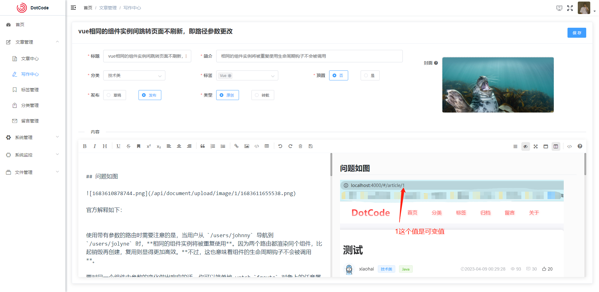    |   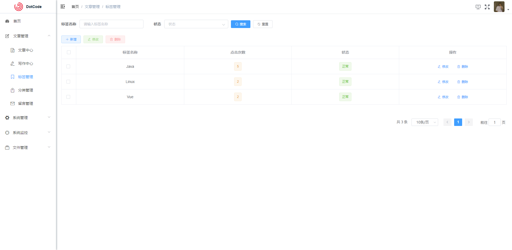   |
| 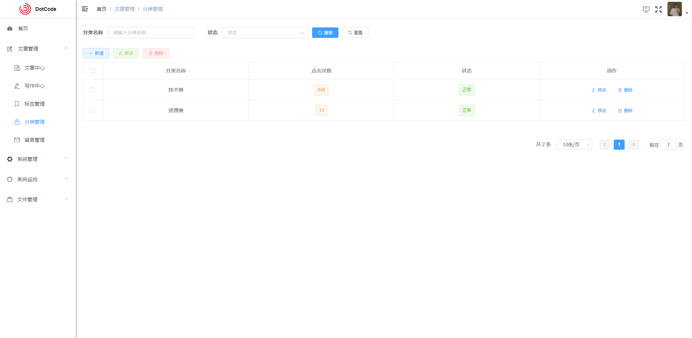  | 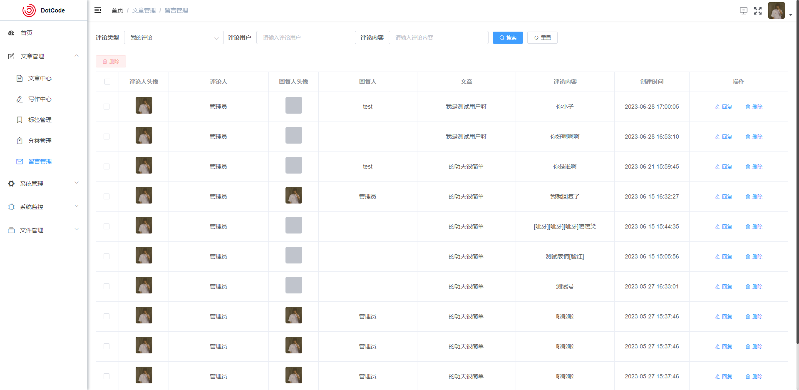  |
|       |      |
|   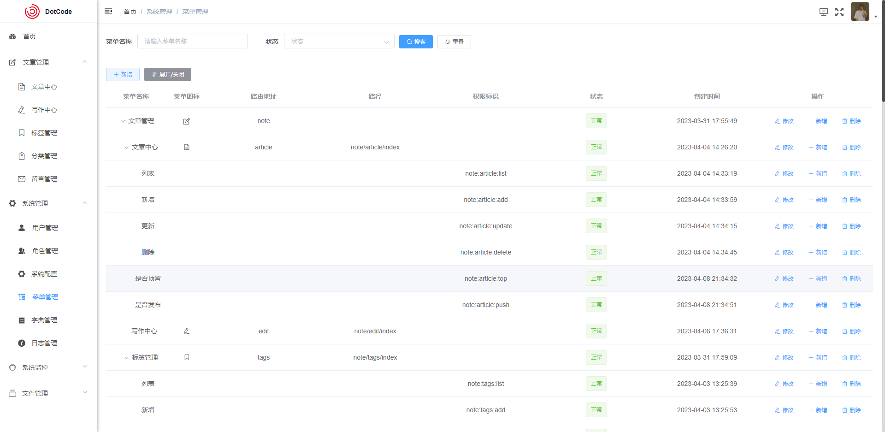    | 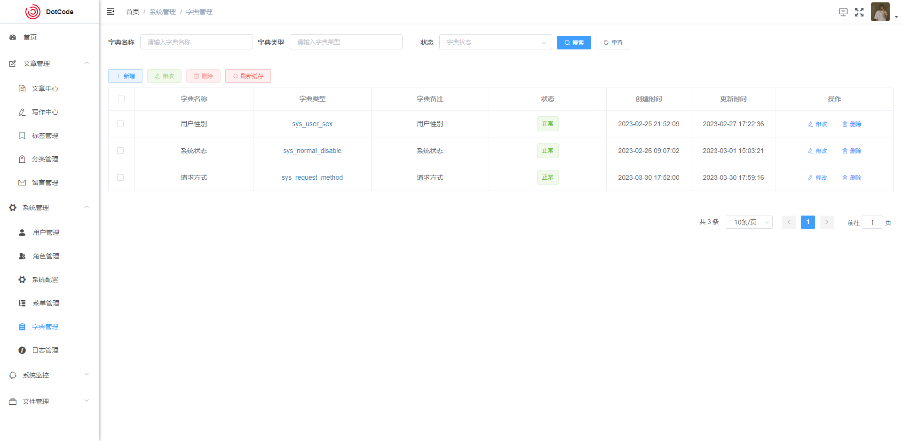 |
|   |   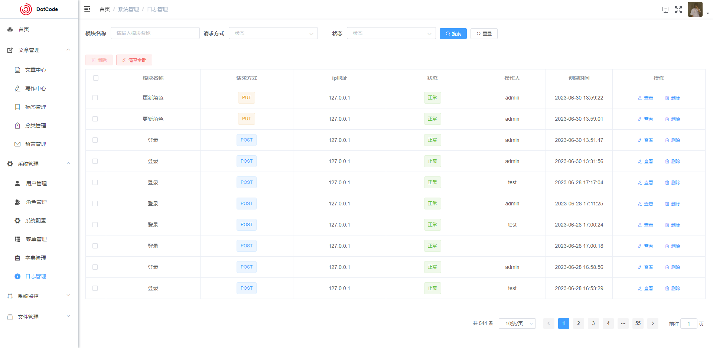    |
| 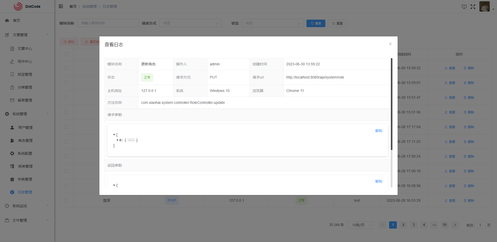  |    |

### web-show

| web-show                                               | web-show                                               |
|--------------------------------------------------------|--------------------------------------------------------|
|           | 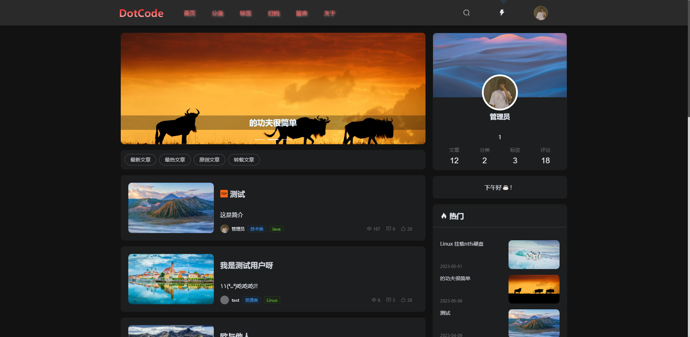     |
| 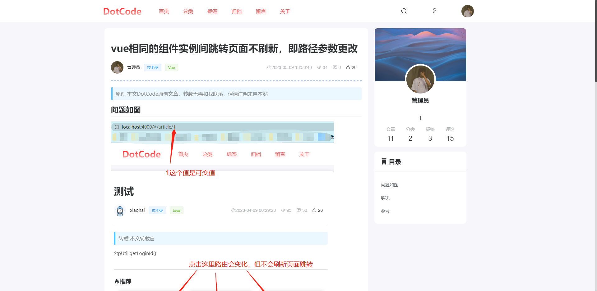        |            |
|        | 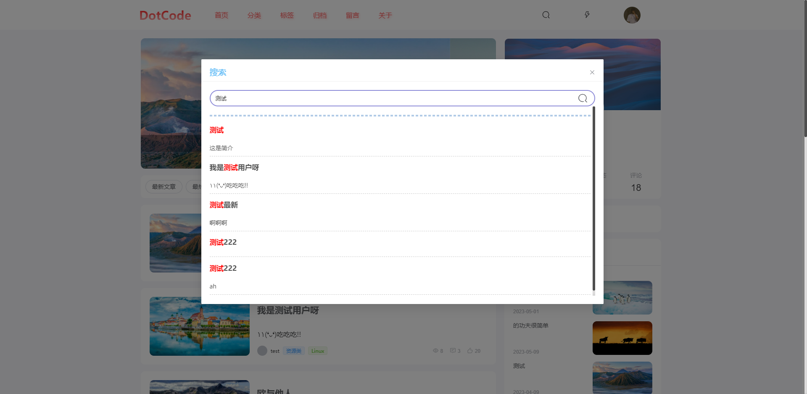         |
| mobile                                                 |  mobile                                                       |
|    | 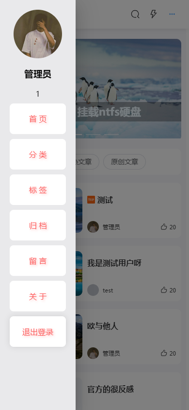    |
| 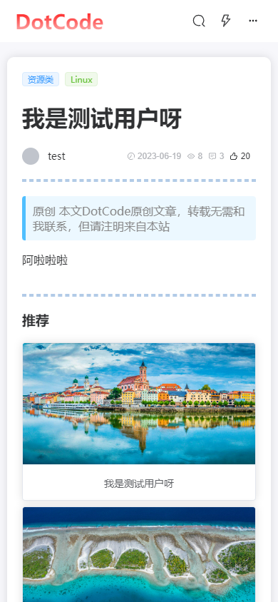 |  |

