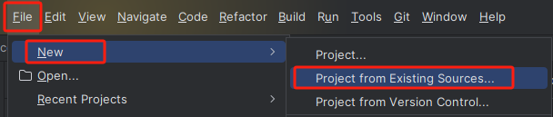
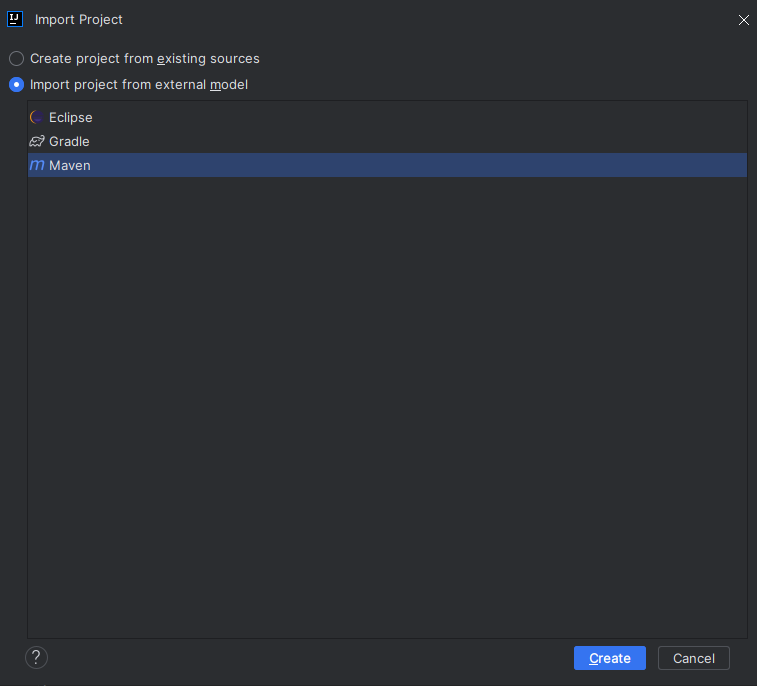

# 使用源码部署

## 准备工作

```
JDK >= 17(推荐17版本)
Mysql >= 8.0(推荐8.0.33版本)
Redis >= 6.0.5
Maven >= 3.0
Node >= 14(推荐14.18.2版本)
```

## 运行系统

前往`Gitee`下载页面(https://gitee.com/wch2019/xiaohai-blog)下载解压到工作目录

### 后端运行

导入到idea，可以按照以下步骤操作：
1. 菜单栏选择`File`-> `New`-> `Project from Existing Sources`（从已有的源代码导入项目）。

  


2. 在弹出的对话框中，选择您要导入的项目的根文件夹，并点击`OK`。

3. 选择您要导入的项目类型Maven并点击`Create`。

   
   
4. 自动加载`Maven`依赖包，初次加载会比较慢（根据自身网络情况而定）

5. 创建数据库`xiaohai_blog`并导入数据脚本`xiaohai_blog.sql`

6. 打开项目运行`com.xiaohai.admin.XiaohaiAdminApplication.java`，出现如下表示启动成功。

   ```
     (♥◠‿◠)ﾉﾞ  启动成功   ლ(´ڡ`ლ)ﾞ 
   ```

>  提示
>
>  后端运行成功可以通过(http://localhost:8089)访问，但是不会出现静态页面，可以继续参考面步骤部署前端，然后通过前端地址来访问。

### 前端后台管理运行

```bash
# 进入项目目录
cd xiaohai-web

# 安装依赖
npm install

# 建议不要直接使用 cnpm 安装以来，会有各种诡异的 bug。可以通过如下操作解决 npm 下载速度慢的问题
npm install --registry=https://registry.npm.taobao.org

# 启动服务
npm run dev
```

浏览器访问 [http://localhost:8080](http://localhost:8080) 默认账户/密码 `admin/123456`

若能正确展示登录页面，并能成功登录，菜单及页面展示正常，则表明后台管理搭建成功

> 提示
>
> 
> 因为本项目是前后端完全分离的，所以需要前后端都单独启动好，才能进行访问。

### 前端展示页运行 

```bash
# 进入项目目录
cd xiaohai-web-show

# 安装依赖
npm install

# 启动服务
npm run dev
```

浏览器访问 http://localhost:4000

> 提示
>
> 
> 因为本项目是前后端完全分离的，所以需要前后端都单独启动好，才能进行访问。

## 必要配置

- 修改服务器配置，`编辑resources目录下的application.yml`

```yml
# 开发环境配置
server:
  # 服务器的HTTP端口，默认为80
  port: 端口
  servlet:
    # 应用的访问路径
    context-path: /应用路径
```

- 修改数据库连接，编辑`resources`目录下的`application.yml`

```yml
# 数据源配置
spring:
  datasource:
    driver-class-name: com.mysql.cj.jdbc.Driver
    url: jdbc:mysql://IP地址:端口号/数据库名?characterEncoding=UTF-8&useUnicode=true&useSSL=false
    username: 数据库账号
    password: 数据库密码
```

+ 修改redis配置，编辑`resources`目录下的`application.yml`

```yml
# redis配置
redis:
  # Redis数据库索引（默认为0）
  database: 1
  # Redis服务器地址
  host: redis地址
  # Redis服务器连接端口
  port: redis端口
  # Redis服务器连接密码（默认为空）
  password: redis密码
```

+ 修改本地文件地址配置，编辑`resources`目录下的`application.yml`

```yml
#系统文件存放配置 
file:
  #文件地址最后加斜杠,注意，示例：window是D:\blog\prod\而linux是/blog/prod/
  profile: /blog/prod/
```

## 部署系统

> 提示
>
> 因为本项目是前后端完全分离的，所以需要前后端都单独部署好，才能进行访问。

### 后端部署

+ 打包工程文件

  在`xiaohai-blog`项目的`doc/bin`目录下执行`build.bat`打包工程，生成jar包文件。
  然后会在项目`xiaohai-blog/xiaohai-admin`模块下`target`文件夹下生包含`jar`

  >提示
  >
  >将`build.bat`中的地址改为自己本地的地址
  >
  >```bash
  >rem 指定您的 Maven 可执行文件的路径
  >set MAVEN_HOME=D:\SoftWare\apache-maven-3.9.2
  >
  >rem 指定项目的根目录
  >set PROJECT_DIR=D:\Project\gitee\xiaohai-blog
  >```

- 部署工程文件(jar部署方式)

  使用命令行执行：`java –jar xiaohai-blog.jar` 或者执行脚本：`xiaohai-blog/doc/bin/run.bat`

  为方便数据库快速初始化，在启动时添加启动参数`--initDatabase`执行数据库初始化，如果已初始化数据库可忽略当前启动参数。

>提示
>
>将`run.bat`中的地址改为自己本地的地址
>
>仅第一次启动时，添加启动参数`--initDatabase`执行数据库初始化，否则会导致数据丢失
>
>```bash
>rem 设置 Java 可执行文件的路径
>set JAVA_HOME=C:\Program Files\Java\jdk-17.0.3.1
>
>rem 设置 JAR 文件的完整路径
>set JAR_FILE=D:\Project\gitee\xiaohai-blog\xiaohai-admin\target\xiaohai-blog.jar
>
>rem 设置日志文件夹路径
>set LOG_FOLDER=D:\Project\gitee\xiaohai-blog\xiaohai-admin\target\logs
>
>rem 设置YML配置文件路径
>set YML_FILE=--spring.config.additional-location=D:\bolg\xiaohai-admin\application.yml
>
>rem 设置 Java 启动参数 添加启动参数--initDatabase执行数据库初始化,注意进初始化使用该命令
>set JAVA_OPTS=
>```

**可指定`application.yml`启动**

```bash
--spring.config.additional-location=./application.yml
```

在打包时如果已配置`application.yml`，可忽略。在项目`xiaohai-blog/doc/application.yml`请根据[必要配置](# 必要配置)进行填写。

### 前端部署

前端后台管理页、展示页部署一致

只需要运行一行命令就可以打包你的应用

```bash
# 构建测试环境
npm run build:stage

# 构建生产环境
npm run build:prod
```

构建打包成功之后，会在根目录生成 `dist` 文件夹，里面就是构建打包好的文件，通常是 `***.js` 、`***.css`、`index.html` 等静态文件。

通常情况下 `dist` 文件夹的静态文件发布到你的 `nginx` 或者静态服务器即可，其中的 `index.html` 是后台服务的入口页面。

>环境变量
>
>所有测试环境或者正式环境变量的配置都在 `.env.development`等 `.env.xxxx`文件中。

注意：打包配置的地址`prod-api`与后台的`context-path`和nginx一致

**web-show配置**

```js
# 代理地址
VITE_API_URL='/prod-api'

#文件地址路径
VITE_APP_BASE_API_FILE='/prod-api/document/upload'

#管理地址
VITE_APP_BLOG_WEB_API='/manage'
```

**web配置**

```JS
#文件地址路径
VUE_APP_BASE_API_FILE = '/prod-api/document/upload'

# base api
VUE_APP_BASE_API = '/prod-api'

#门户地址
VUE_APP_BLOG_WEB_API='/#'
```

## Nginx配置

```bash
server {
    listen       80;
    server_name  localhost;
    
        location / {
            alias D:/bolg/xiaohai-web-show/;   #修改为xiaohai-web-show的打包路径
            try_files $uri $uri/ /index.html;
            index  index.html index.htm;
        }
    
        location /manage/ {
            alias  D:/bolg/xiaohai-web/; #修改为xiaohai-web的打包路径
            try_files $uri $uri/ /manage/index.html;
            index  index.html index.htm;
        }
    
        location /prod-api/ {
    		proxy_set_header Host $http_host;
    		proxy_set_header X-Real-IP $remote_addr;
    		proxy_set_header REMOTE-HOST $remote_addr;
    		proxy_set_header X-Forwarded-For $proxy_add_x_forwarded_for;
    		proxy_pass http://127.0.0.1:8089/prod-api/; #修改为后台请求地址
    	}
    
        error_page   500 502 503 504  /50x.html;
        location = /50x.html {
            root   html;
        }
    }
    
```

